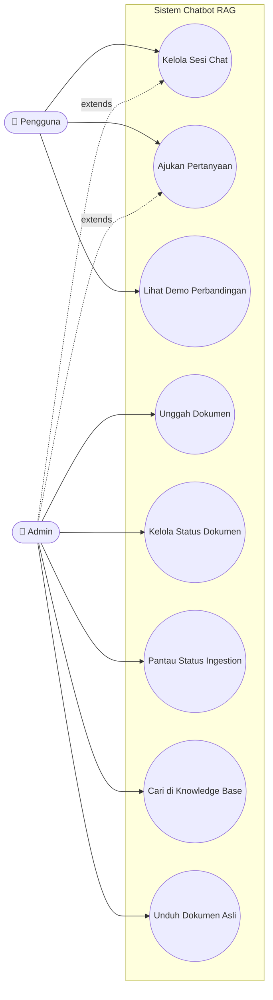

# 01. Diagram Use Case

> Aktor dan use case diturunkan langsung dari daftar endpoint di [10-referensi-api.md](10-referensi-api.md) — tidak ada use case yang tidak didukung API aktual.

## 1.1 Aktor

| Aktor | Deskripsi |
|---|---|
| **Pengguna** | Pengguna akhir yang bertanya ke chatbot melalui halaman `/` |
| **Admin** | Pengelola knowledge base melalui halaman `/admin/` — mengunggah, mengaktifkan/menonaktifkan, dan menghapus dokumen sumber |

Admin adalah *superset* dari Pengguna: siapa pun yang bisa mengakses `/admin/` juga bisa mengakses `/` dan melakukan seluruh use case Pengguna (tidak ada pemisahan akun/otentikasi berbasis role di level API — pembagian ini murni berdasarkan halaman frontend yang diakses).

## 1.2 Diagram Use Case

## 1.3 Deskripsi Use Case

### UC1 — Kelola Sesi Chat
- **Aktor**: Pengguna, Admin
- **Endpoint**: `POST/GET/DELETE /api/chat/sessions[/{id}]`
- **Precondition**: Tidak ada (sesi baru dapat dibuat kapan saja)
- **Alur utama**: Pengguna membuka halaman chat → sistem membuat/menampilkan sesi → pengguna dapat melihat riwayat sesi sebelumnya atau menghapus sesi
- **Postcondition**: Sesi tersimpan di tabel `sessions` (PostgreSQL)

### UC2 — Ajukan Pertanyaan
- **Aktor**: Pengguna, Admin
- **Endpoint**: `POST /api/chat/sessions/{session_id}/stream`
- **Precondition**: Sesi chat sudah ada; minimal satu dokumen aktif di KB (jika tidak, akan selalu dinilai *irrelevant*)
- **Alur utama**: Lihat detail lengkap di [08-pipeline-chat.md](08-pipeline-chat.md) — pengguna mengirim pesan → IVM safety check → retrieval → IVM relevance gate → generasi jawaban dengan LLM → RAM menilai tiap kalimat → jawaban + sitasi di-stream kembali
- **Postcondition**: Pesan pengguna & jawaban asisten tersimpan di tabel `messages`
- **Use case ini secara internal memakai mesin retrieval yang sama dengan UC7** (`SearchService`), tetapi dipanggil langsung sebagai fungsi Python, bukan lewat HTTP `/api/kb/search`

### UC3 — Lihat Demo Perbandingan
- **Aktor**: Pengguna, Admin
- **Endpoint**: Halaman `/demo/`, memakai `GET /api/kb/naive-search` dan alur chat biasa
- **Alur utama**: Pengguna memasukkan kueri yang sama ke dua mode pencarian side-by-side — pencarian judul literal (naif, meniru portal JDIH konvensional) vs jawaban RAG lengkap — untuk membandingkan kualitas

### UC4 — Unggah Dokumen
- **Aktor**: Admin
- **Endpoint**: `POST /api/admin/pdfs` (satu file) atau `/batch` (banyak file)
- **Precondition**: File berupa PDF
- **Alur utama**: Lihat [06-pipeline-ingestion.md](06-pipeline-ingestion.md) — admin unggah PDF + judul/deskripsi → sistem menyimpan file & membuat record dokumen → ingestion berjalan asinkron di background
- **Postcondition**: Dokumen berstatus `pending`/`processing`, akan berubah menjadi `completed`/`failed`

### UC5 — Kelola Status Dokumen
- **Aktor**: Admin
- **Endpoint**: `PUT /api/admin/pdfs/{id}/status` (aktif/nonaktif), `DELETE /api/admin/pdfs/{id}` (hapus)
- **Alur utama**: Admin melihat daftar dokumen (`GET /api/admin/pdfs`) → menonaktifkan dokumen (soft-delete, vektor tetap ada tapi tidak dipakai retrieval) atau menghapusnya permanen

### UC6 — Pantau & Ulangi Status Ingestion
- **Aktor**: Admin
- **Endpoint**: `GET /api/admin/pdfs/{id}/ingestion-status`, `POST /api/admin/pdfs/{id}/reingest`
- **Alur utama**: Admin polling status ingestion dari UI; jika macet/gagal, admin dapat memicu ulang (`reingest`) tanpa unggah ulang file

### UC7 — Cari di Knowledge Base
- **Aktor**: Admin (sebagai alat uji/debug), juga dipakai skrip evaluasi internal
- **Endpoint**: `GET /api/kb/search`
- **Alur utama**: Lihat [07-pipeline-retrieval.md](07-pipeline-retrieval.md) — mengembalikan hasil retrieval mentah beserta skor, untuk keperluan debugging kualitas retrieval di luar alur chat penuh

### UC8 — Unduh Dokumen Asli
- **Aktor**: Admin
- **Endpoint**: `GET /api/kb/pdfs/{id}/download`
- **Alur utama**: Admin mengunduh file PDF asli yang tersimpan di `uploads/knowledge_base/` untuk verifikasi manual

---
⟵ [00-gambaran-umum.md](00-gambaran-umum.md) | [README.md](README.md) (indeks) | [02-arsitektur.md](02-arsitektur.md) ⟶
