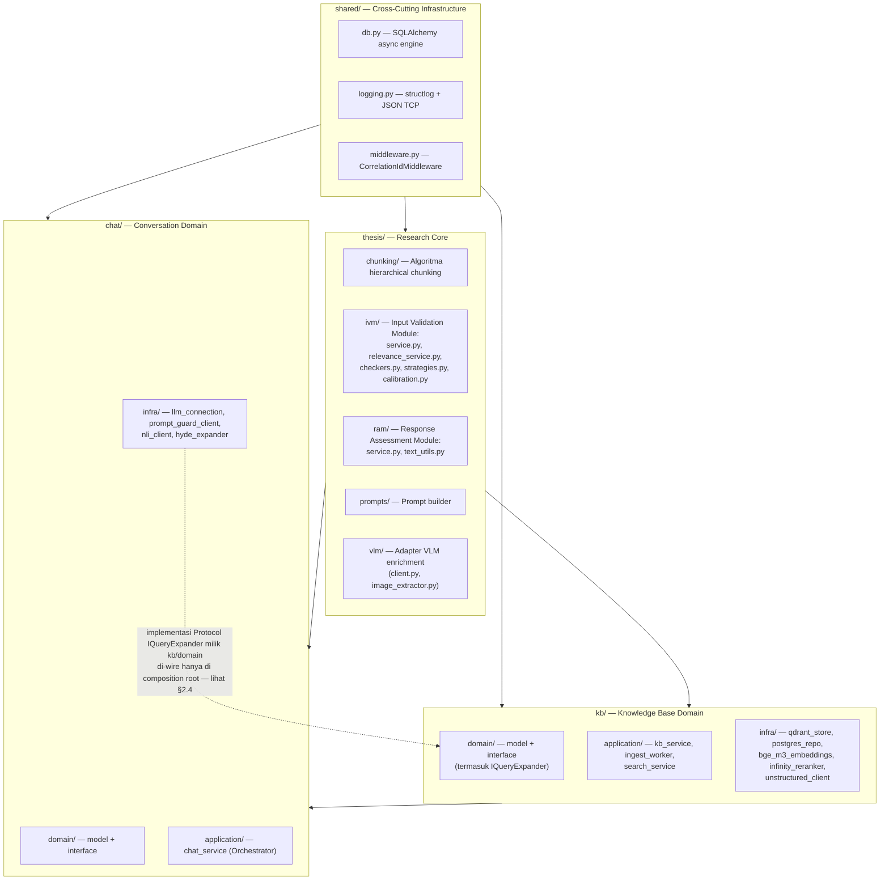
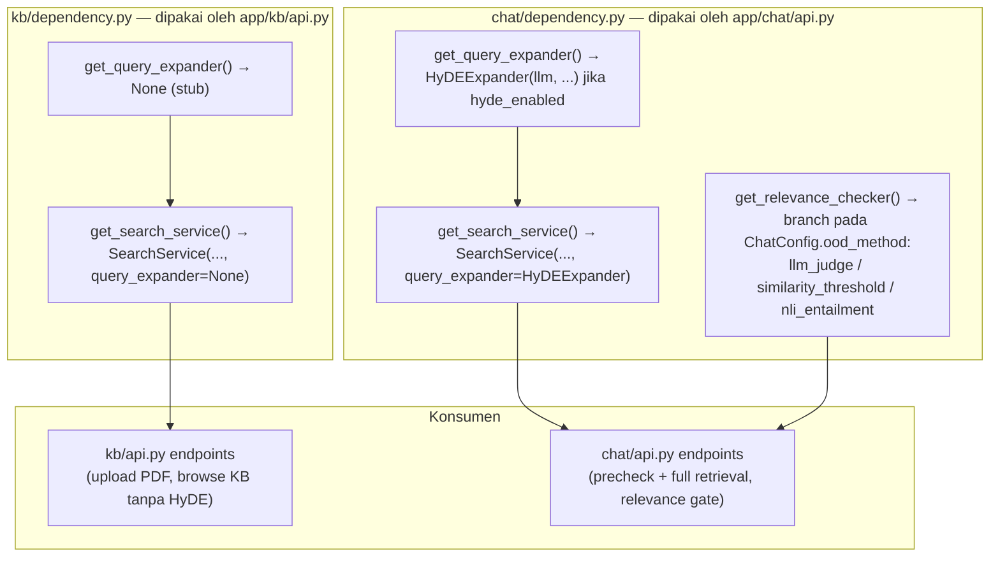

# 02. Arsitektur Sistem

> Sumber: `writing/chapter3.md` §3.2 (diadaptasi menjadi dokumen referensi mandiri, konten diverifikasi terhadap struktur kode aktual).

## 2.1 Domain-Driven Design (DDD)

Sistem mengadopsi **Domain-Driven Design** dengan lapisan yang memiliki aturan dependensi ketat, memisahkan inti riset (*pure research core*) dari infrastruktur teknis.

Aturan "tanpa impor infra" berlaku untuk `chunking/`, `ivm/`, `ram/`, dan `prompts/` — keempatnya hanya bergantung pada Python stdlib dan `Protocol`. `vlm/client.py` adalah pengecualian: ia memanggil `httpx` langsung ke OpenRouter/Ollama.

## 2.2 Aturan Dependensi

| Source | Boleh Mengimpor | Dilarang Mengimpor |
|---|---|---|
| `thesis/{chunking,ivm,ram,prompts}` | Python stdlib + `Protocol` saja | `chat`, `kb`, `shared/config`, semua infra |
| `thesis/vlm` | Python stdlib, `httpx` | `chat`, `kb`, `shared/config` |
| `kb/domain` | `thesis/chunking/models` (tipe data saja) | `kb/infra`, `chat` |
| `kb/application` | `kb/domain`, `kb/infra`, `thesis/chunking`, `thesis/ivm`, `thesis/vlm` | `chat` |
| `kb/infra` | `kb/domain` | `chat`, `thesis` |
| `chat/domain` | Python stdlib, SQLAlchemy | `kb`, `thesis` |
| `chat/application` | `chat/domain`, `chat/infra`, `kb/application`, `thesis/ivm`, `thesis/ram`, `thesis/prompts` | `kb/infra`, `kb/domain` |
| `chat/infra` | `chat/domain`, `kb/domain` (Protocol saja), `thesis/ivm/interfaces`, `thesis/ram/interfaces` | `kb/application`, `kb/infra`, `chat/application` |

`tools/visualize/` (tooling pengembangan untuk artefak visualisasi pipeline offline) tidak tercakup tabel ini — modul ini tidak pernah diimpor oleh `kb/` atau `chat/`, di luar graf dependensi runtime.

## 2.3 Dependency Inversion — Protocol Interfaces

Modul `thesis/` dan `kb/domain/` mendefinisikan **Protocol interfaces** untuk kapabilitas eksternal; `chat/infra/` dan `kb/infra/` mengimplementasikannya. Inti riset tidak pernah mengetahui tentang HTTP client, API key, atau server Infinity — Dependency Inversion Principle murni.

```mermaid
classDiagram
    class ISafetyModel {
        <<Protocol>>
        +check_prompt(text str) SafetyResult
    }
    class INLIModel {
        <<Protocol>>
        +check(premise str, hypothesis str) NLIResult
    }
    class IRelevanceChecker {
        <<Protocol>>
        +check_query(query, context_chunks, context_scores) bool
        +check_document(document_chunks) bool
    }
    class IVLMEnricher {
        <<Protocol>>
        +describe_image(image_path str) str
    }
    class ITextEmbedder {
        <<Protocol>>
        +embed_texts(texts) List~EmbeddingResult~
    }
    class IDocumentParser {
        <<Protocol>>
        +parse_pdf(file_path str) List~ParsedElement~
    }
    class IVectorStore {
        <<Protocol>>
        +upsert_chunks(chunks) None
        +hybrid_search(dense, sparse, top_k) List~SearchResult~
    }
    class IQueryExpander {
        <<Protocol — didefinisikan di kb/domain>>
        +expand(query str) str
    }

    class PromptGuardClient
    class NLIClient
    class LLMJudgeRelevanceChecker
    class SimilarityThresholdRelevanceChecker
    class NliEntailmentRelevanceChecker
    class OpenRouterVLMClient
    class BGEM3Embeddings
    class UnstructuredClient
    class QdrantStore
    class HyDEExpander

    ISafetyModel <|.. PromptGuardClient : implements
    INLIModel <|.. NLIClient : implements
    IRelevanceChecker <|.. LLMJudgeRelevanceChecker : implements
    IRelevanceChecker <|.. SimilarityThresholdRelevanceChecker : implements
    IRelevanceChecker <|.. NliEntailmentRelevanceChecker : implements
    IVLMEnricher <|.. OpenRouterVLMClient : implements
    ITextEmbedder <|.. BGEM3Embeddings : implements
    IDocumentParser <|.. UnstructuredClient : implements
    IVectorStore <|.. QdrantStore : implements
    IQueryExpander <|.. HyDEExpander : implements
    note for HyDEExpander "chat/infra — mengimplementasikan Protocol milik kb/domain"
```

`QdrantStore` mengimplementasikan `IVectorStore` untuk satu collection Qdrant (`knowledge_base`, lihat [05-basis-data.md](05-basis-data.md)). `BGEM3Embeddings` menjalankan BGE-M3 *in-process* (bukan lewat HTTP ke Infinity) karena model list Infinity sendiri mendaftarkan `BAAI/bge-m3` sebagai dense-only — batasan server, bukan kesalahan konfigurasi.

## 2.4 Layanan Eksternal

| Layanan | Port | Peran |
|---|---|---|
| PostgreSQL 17 | 5432 | Metadata dokumen, parent chunks, sesi chat, kalibrasi relevansi |
| Qdrant 1.18 | 6333 (HTTP), 6334 (gRPC) | Indeks vektor hybrid (dense + sparse) untuk child chunks |
| Infinity 0.0.77 | 7997 | Reranking (BGE-reranker-v2-m3), PromptGuard (Llama-PG-2-86M), NLI (indo-roberta) |
| Unstructured API | 8001 | Parsing PDF → elemen terstruktur (strategi `hi_res`) |
| OpenRouter / Ollama | 443 / 11434 | LLM inference (chat) dan VLM (deskripsi gambar/diagram) |

Detail topologi container ada di [11-deployment.md](11-deployment.md).

## 2.5 Dua Composition Root Paralel

HyDE query expansion dan metode relevansi `llm_judge` memerlukan koneksi LLM yang hanya boleh diimplementasikan di `chat/infra` — mengimpornya langsung dari `kb/` akan melanggar aturan dependensi §2.2. Solusinya adalah dua *provider* paralel bernama sama di dua modul composition-root berbeda (bukan `dependency_overrides` FastAPI — mekanisme itu tidak dipakai di `app/main.py`):

`IngestWorker` (`kb/application`) tidak bergantung pada `IQueryExpander` maupun `IRelevanceChecker` sama sekali — pipeline ingestion murni transformasi struktural, tanpa validasi relevansi dokumen di sisi tulis (keputusan relevansi seluruhnya terjadi di sisi baca, saat kueri chat masuk — lihat [09-ivm-ram-keamanan.md](09-ivm-ram-keamanan.md)).

---
⟵ [01-use-case.md](01-use-case.md) | [README.md](README.md) (indeks) | [03-dfd.md](03-dfd.md) ⟶
