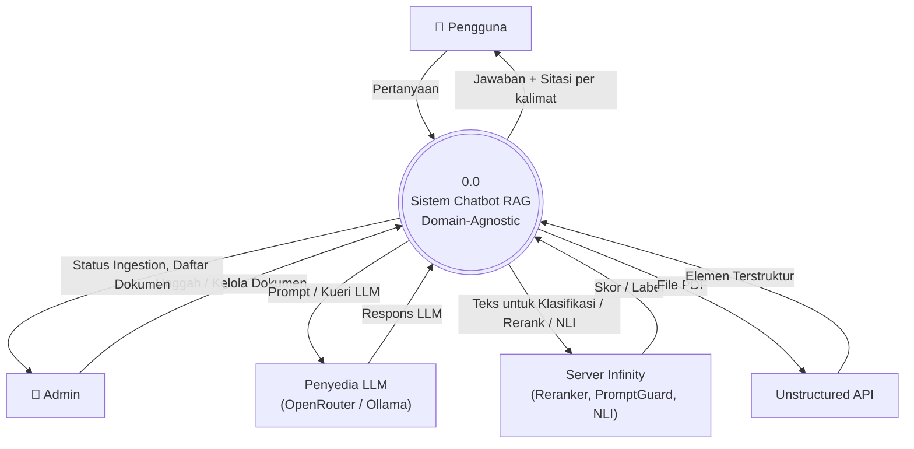
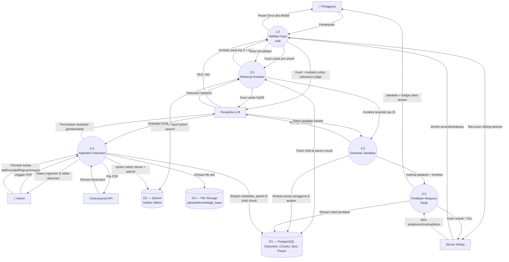

# 03. Data Flow Diagram (DFD)

> Konten baru — sistem belum memiliki DFD notasi klasik sebelumnya (yang ada di `writing/chapter3.md` adalah flowchart/ERD/class diagram). Diturunkan dari fakta pipeline yang sudah diverifikasi di [06](06-pipeline-ingestion.md)–[09](09-ivm-ram-keamanan.md), digambar mengikuti notasi Gane-Sarson: **persegi panjang** = entitas eksternal, **lingkaran bernomor** = proses, **silinder** = data store.

## 3.1 Diagram Konteks (Level 0)

Level 0 menunjukkan sistem sebagai satu proses tunggal beserta seluruh entitas eksternal yang berinteraksi dengannya.

**Entitas eksternal:**

| Entitas | Peran |
|---|---|
| Pengguna | Mengirim pertanyaan, menerima jawaban + sitasi |
| Admin | Mengunggah & mengelola dokumen KB, memantau status ingestion |
| Penyedia LLM | Menjawab prompt (generasi jawaban, HyDE, LLM-judge relevansi, deskripsi VLM) |
| Server Infinity | Mengklasifikasi keamanan prompt, me-rerank kandidat, mengevaluasi entailment NLI |
| Unstructured API | Mem-parsing PDF mentah menjadi elemen terstruktur |

## 3.2 DFD Level 1 — Dekomposisi Proses

Proses 0.0 didekomposisi menjadi 5 proses bernomor. Aliran eksternal pada level ini **seimbang** dengan Level 0 — tidak ada entitas eksternal baru, hanya diperjelas proses mana yang benar-benar mengonsumsi/menghasilkan tiap aliran.

**Deskripsi proses:**

| Proses | Deskripsi singkat | Detail lengkap |
|---|---|---|
| 1.0 Validasi Input (IVM) | Memeriksa keamanan prompt (deteksi injection) dan relevansi domain (OOD) sebelum kueri diproses lebih lanjut | [09-ivm-ram-keamanan.md](09-ivm-ram-keamanan.md) |
| 2.0 Retrieval Konteks | Mencari konteks relevan dari knowledge base (opsional HyDE → embed → hybrid search → rerank → hidrasi sibling/cross-ref) | [07-pipeline-retrieval.md](07-pipeline-retrieval.md) |
| 3.0 Generasi Jawaban | Menyusun prompt dari konteks terambil dan men-stream jawaban dari LLM | [08-pipeline-chat.md](08-pipeline-chat.md) |
| 4.0 Penilaian Respons (RAM) | Menilai tiap kalimat jawaban terhadap konteks sumber via NLI, melampirkan badge sitasi | [09-ivm-ram-keamanan.md](09-ivm-ram-keamanan.md) |
| 5.0 Ingestion Dokumen | Mem-parsing, chunking, embedding, dan mengindeks dokumen PDF baru | [06-pipeline-ingestion.md](06-pipeline-ingestion.md) |

**Data store:**

| Data Store | Isi |
|---|---|
| D1 — PostgreSQL | `pdf_documents`, `parent_chunks`, `child_chunks`, `ingestion_tasks`, `sessions`, `messages` |
| D2 — Qdrant | Collection `knowledge_base`: vektor dense (1024-dim) + sparse (BM25) per child chunk |
| D3 — File Storage | File PDF asli (`uploads/knowledge_base/`) |

Skema lengkap tiap data store ada di [05-basis-data.md](05-basis-data.md).

## 3.3 Catatan Leveling

- Proses 1.0 dan 2.0 saling bertukar data dua arah: 1.0 memerlukan hasil pencarian awal (top-3) dari 2.0 untuk memutuskan relevansi, sebelum 2.0 dipanggil ulang untuk pencarian dalam (top-15) — ini disebut *two-stage retrieval* di [08-pipeline-chat.md](08-pipeline-chat.md).
- Proses 5.0 (ingestion) berjalan independen dari 1.0–4.0 dan tidak pernah memanggil `IRelevanceChecker` — tidak ada validasi relevansi dokumen di sisi tulis, murni transformasi struktural (lihat [02-arsitektur.md](02-arsitektur.md) §2.5).
- Flow "Prompt / Kueri LLM" di Level 0 adalah agregasi dari 4 pemakaian LLM berbeda di Level 1 (relevance judge, HyDE, generasi jawaban, deskripsi VLM) — seluruhnya memakai entitas eksternal yang sama (OpenRouter/Ollama, API OpenAI-compatible) sehingga digabung menjadi satu entitas di Level 0.

---
⟵ [02-arsitektur.md](02-arsitektur.md) | [README.md](README.md) (indeks) | [04-diagram-aktivitas.md](04-diagram-aktivitas.md) ⟶
