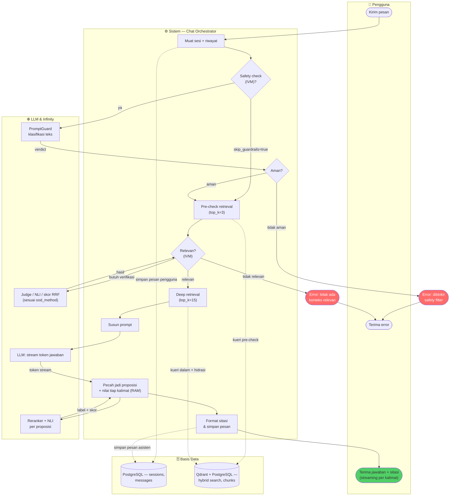
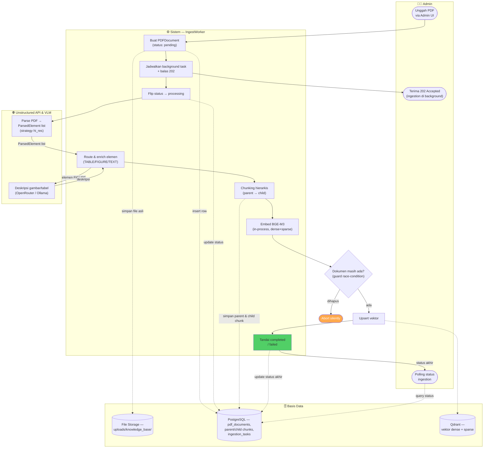

# 04. Diagram Aktivitas (Process Flow, Swimlane)

> Konten baru — melengkapi flowchart langkah-demi-langkah di [06](06-pipeline-ingestion.md)/[08](08-pipeline-chat.md) dengan pandangan **lintas-fungsi**: siapa/komponen apa yang menjalankan tiap langkah. Mermaid tidak memiliki primitif swimlane asli, sehingga tiap "lane" digambar sebagai `subgraph` — teknik yang sama yang sudah dipakai `writing/chapter3.md` untuk tahapan pipeline.

## 4.1 Alur Tanya-Jawab Chat

Lane: **Pengguna** / **Sistem (Chat Orchestrator: IVM → Retrieval → Generasi → RAM)** / **LLM & Infinity (eksternal)** / **Basis Data (PostgreSQL + Qdrant)**.

Urutan langkah ini identik dengan flowchart detail di [08-pipeline-chat.md](08-pipeline-chat.md) — diagram ini hanya menambahkan dimensi "siapa yang mengerjakan apa" yang tidak eksplisit di flowchart linear.

## 4.2 Alur Unggah & Ingestion Dokumen

Lane: **Admin** / **Sistem (IngestWorker)** / **Unstructured API & VLM (eksternal)** / **Basis Data (PostgreSQL + Qdrant + File Storage)**.

Urutan langkah ini identik dengan flowchart 8-tahap di [06-pipeline-ingestion.md](06-pipeline-ingestion.md); diagram ini menambahkan pemisahan tanggung jawab per komponen (Admin vs Sistem vs layanan eksternal vs data store).

---
⟵ [03-dfd.md](03-dfd.md) | [README.md](README.md) (indeks) | [05-basis-data.md](05-basis-data.md) ⟶
