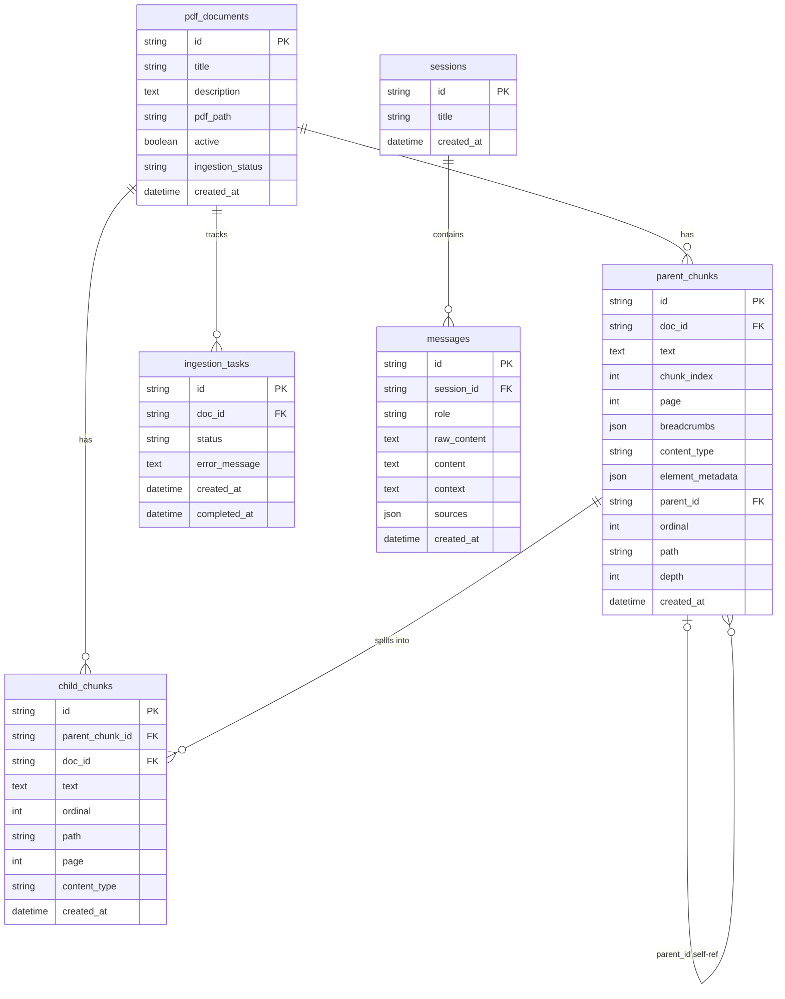

# 05. Perancangan Basis Data

> Sumber: `writing/chapter3.md` §3.3 (diadaptasi menjadi dokumen referensi mandiri).

## 5.1 Skema PostgreSQL (Relational Database)

Basis data relasional menyimpan seluruh metadata, teks penuh *parent chunk*, riwayat percakapan, dan status ingestion.

## 5.2 Deskripsi Tabel

**`pdf_documents`** — Metadata setiap dokumen PDF yang diunggah ke knowledge base.
- `active`: *soft-delete flag* — menonaktifkan dokumen tanpa menghapus vektornya di Qdrant.
- `ingestion_status`: mirror dari status `ingestion_tasks` terbaru untuk kemudahan tampilan UI.

**`parent_chunks`** — Teks penuh *section-level chunks* untuk strategi Small-to-Big retrieval (lihat [07-pipeline-retrieval.md](07-pipeline-retrieval.md)).
- `breadcrumbs`: array JSON jalur hierarki seksi, contoh: `["BAB III", "Pasal 12", "Ayat 3"]`.
- `content_type`: tipe struktural (`text`, `table`, `figure`, `hybrid`).
- `element_metadata`: metadata asli parser (HTML tabel, path gambar, ringkasan tabel).
- `path` + `depth`: hierarki ltree-style untuk lookup sibling/cross-reference.

**`child_chunks`** — *Sentence-level chunks* yang diindeks di Qdrant untuk presisi retrieval, dan juga disimpan di PostgreSQL agar `SearchService` dapat mengambil teks + breadcrumb child langsung lewat `id` tanpa bolak-balik ke Qdrant per hasil.
- Terhubung ke parent melalui `parent_chunk_id` — dasar strategi Small-to-Big.

**`ingestion_tasks`** — State machine untuk melacak status pipeline ingestion asinkron. Lihat state diagram di [06-pipeline-ingestion.md](06-pipeline-ingestion.md).

**`sessions`** — Sesi percakapan.

**`messages`** — Setiap pesan dalam sesi percakapan.
- `context`: teks gabungan parent chunks yang dipakai sebagai konteks RAG, disimpan untuk restore UI.
- `sources`: kolom JSON — payload yang disimpan berbentuk `[{title, page, breadcrumbs, text}, ...]`, satu entri per konteks yang dipakai untuk menjawab.

Tidak ada tabel tambahan untuk kalibrasi relevansi — threshold `similarity_threshold`/`nli_entailment` (lihat [09-ivm-ram-keamanan.md](09-ivm-ram-keamanan.md)) adalah nilai konfigurasi statis, bukan state yang disimpan atau diperbarui otomatis di database.

## 5.3 Skema Qdrant (Vector Database)

Qdrant menyimpan vektor *child chunks* dalam satu collection `knowledge_base` dengan dua ruang vektor:

| Nama Vektor | Tipe | Dimensi | Distance / Modifier |
|---|---|---|---|
| `dense` | Dense | 1024 | Cosine similarity |
| `bm25` | Sparse | variabel | IDF (Inverse Document Frequency) |

**Payload fields** per Qdrant point:

| Field | Tipe | Kegunaan |
|---|---|---|
| `parent_chunk_id` | keyword | Link Small-to-Big: fetch teks parent dari PostgreSQL |
| `doc_id` | keyword | Filter pencarian & bulk deletion per dokumen |
| `is_active` | boolean | Soft-deactivation tanpa menghapus vektor |
| `breadcrumbs` | array | Jalur hierarki seksi untuk konteks struktural |
| `content_type` | keyword | Filter berdasarkan tipe konten |
| `session_id` | keyword | Opsional: scoped KB per sesi percakapan |

Payload index dibuat pada semua field filter (`is_active`, `session_id`, `doc_id`, `content_type`) untuk mempercepat filtered search. `QdrantStore` mengelola tepat satu collection — tidak ada collection kedua untuk keperluan relevansi; deteksi domain-relevansi sepenuhnya terjadi di jalur baca (lihat [09-ivm-ram-keamanan.md](09-ivm-ram-keamanan.md)), bukan lewat indeks tambahan yang dibangun saat ingestion.

---
⟵ [04-diagram-aktivitas.md](04-diagram-aktivitas.md) | [README.md](README.md) (indeks) | [06-pipeline-ingestion.md](06-pipeline-ingestion.md) ⟶
