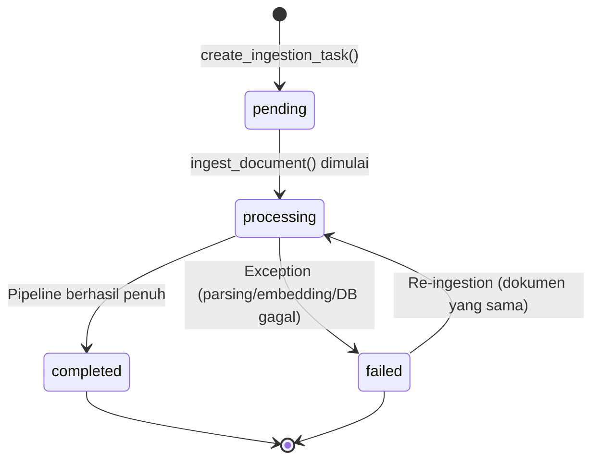
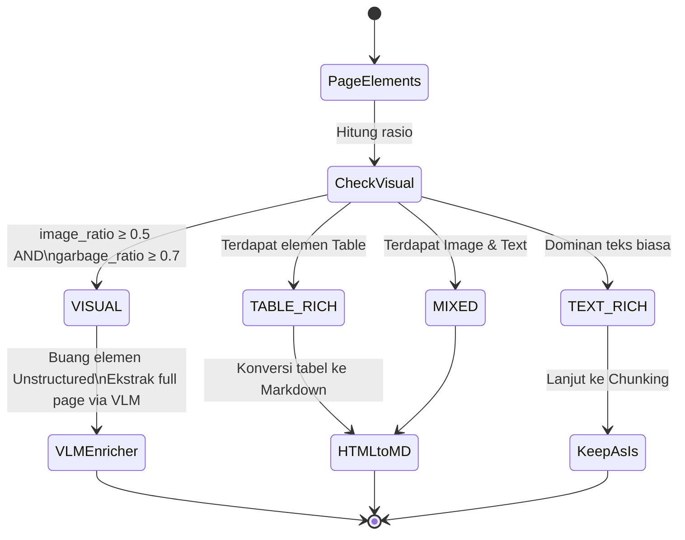
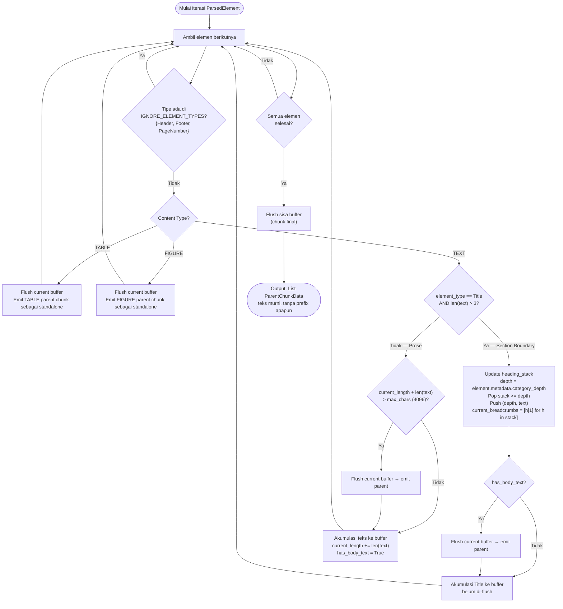
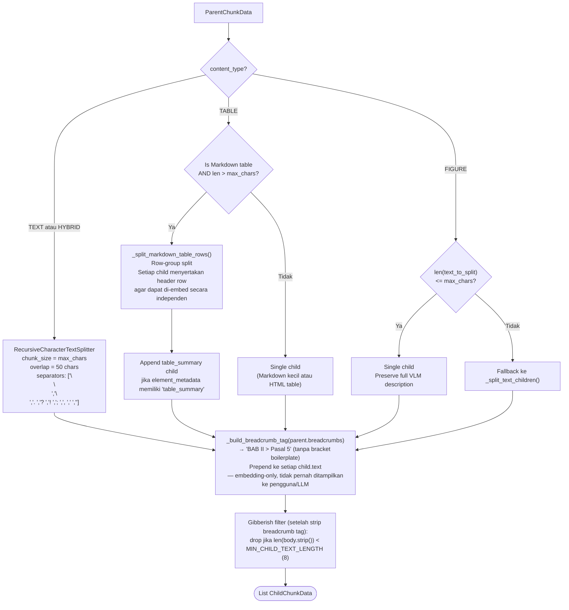

# 06. Pipeline Ingestion Dokumen

> Sumber: `writing/chapter3.md` §3.4 (diadaptasi menjadi dokumen referensi mandiri).

## 6.1 Gambaran Umum

Pipeline ingestion adalah jalur tulis (*write-path*) sistem RAG: mentransformasi PDF mentah menjadi indeks vektor hybrid yang dapat dicari. Kualitas ingestion menentukan kualitas retrieval, yang menentukan kualitas jawaban LLM. Pipeline ini murni transformasi struktural — **tidak ada validasi relevansi domain di sisi tulis**; `IngestWorker` tidak bergantung pada `IRelevanceChecker` maupun `IQueryExpander` sama sekali (lihat [02-arsitektur.md](02-arsitektur.md) §2.5). Keputusan "apakah kueri ini relevan dengan KB" seluruhnya terjadi di sisi baca, saat pertanyaan chat masuk (lihat [09-ivm-ram-keamanan.md](09-ivm-ram-keamanan.md)).

Trigger: `POST /api/admin/pdfs` atau `/reingest` (lihat [10-referensi-api.md](10-referensi-api.md)). Pandangan lintas-aktor (Admin vs Sistem vs layanan eksternal) tersedia di [04-diagram-aktivitas.md](04-diagram-aktivitas.md) §4.2.

## 6.2 Flowchart Upload dan Ingestion PDF

```mermaid
flowchart TD
    A([Pengguna unggah PDF\nvia Admin UI]) --> B["POST /api/admin/pdfs"]
    B --> C["KBApplicationService.upload_pdf()"]
    C --> D["Simpan file ke disk\nuploads/knowledge_base/"]
    D --> E["Buat PDFDocument row\nstatus: pending"]
    E --> F["BackgroundTasks.add_task\ningest_document(doc_id)"]
    F --> RESP{{"HTTP 202 Accepted\nPDFDocument dikembalikan\ningestion berjalan di background"}}

    F --> H["IngestWorker.ingest_document(doc_id)"]
    H --> I["Buat IngestionTask\nstatus: pending"]
    I --> J["Flip status → processing"]

    J --> K["Stage 1\nUnstructuredClient.parse_pdf()\nstrategy=hi_res, timeout=900s"]
    K --> L{{"ParsedElement list\n(Title, NarrativeText,\nTable, Image, ...)"}}

    L --> Q["Stage 2\n_route_and_enrich_elements()\nSingle-pass routing"]
    Q --> R["classify_element() setiap elemen\n→ ContentType.TABLE/FIGURE/TEXT"]
    R --> S{Content Type?}

    S -->|FIGURE| T["IVLMEnricher.describe_image()\nOpenRouter / Ollama / Fallback"]
    T --> TG{Deskripsi\nberhasil?}
    TG -->|Tidak| DROP[/"Drop elemen\nfail-closed"/]
    TG -->|Ya| TSS["el.text = description"]

    S -->|TABLE| U["html_table_to_markdown()\nPreserve HTML di element_metadata"]
    S -->|TEXT| V[Keep as-is]

    TSS --> FILT["Filter elemen teks kosong\nfinal_elements = [el for el if el.text.strip()]"]
    U --> FILT
    V --> FILT

    FILT --> AA["Stage 3\ncreate_parent_chunks()\nTitle-boundary splitting + heading_stack + breadcrumbs"]
    AA --> AC["Tables & Figures → standalone parents\nText → accumulated under Title boundary"]
    AC --> AD[["ParentChunkData list"]]

    AD --> AE["Stage 4\nsave_parent_chunks()\nBulk insert ke PostgreSQL"]
    AE --> AF["Stage 5\nsplit_into_children()\nContent-type-aware dispatcher"]
    AF --> AG{Content Type?}
    AG -->|TEXT| AH["_split_text_children()\nRecursiveCharacterTextSplitter\nSentence-aware separators"]
    AG -->|TABLE| AI["_split_table_children()\nMarkdown: row-group + header repeat\nHTML: single child"]
    AG -->|FIGURE| AJ["_split_figure_children()\nSingle child jika muat\nFallback ke text split"]
    AH --> AK["Gibberish filter\ndrop len < 8 chars"]
    AI --> AK
    AJ --> AK
    AK --> AL[["ChildChunkData list"]]

    AL --> AL2["Stage 5b\nsave_child_chunks()\nBulk insert ChildChunk rows ke PostgreSQL\n(memungkinkan SearchService fetch child\nlangsung by id — lihat 07-pipeline-retrieval.md)"]
    AL2 --> AM["Stage 6\nBGEM3Embeddings.embed_texts()\nBGE-M3 in-process: dense 1024-dim + sparse BM25"]
    AM --> AN{"Race-condition guard\nPDFDocument masih ada?"}
    AN -->|Dihapus| AO[/"Abort silently"/]
    AN -->|Masih ada| AP["Stage 7\nQdrantStore.upsert_chunks()\nDual vector storage, batch=100"]
    AP --> AQ["Stage 8\nMark task: COMPLETED\nUpdate PDFDocument.ingestion_status"]
    AQ --> AR([Selesai])

    style DROP fill:#ff6b6b,color:#fff
    style AO fill:#ffa94d,color:#fff
    style AR fill:#51cf66,color:#fff
    style RESP fill:#74c0fc,color:#333
```

## 6.3 State Machine Ingestion Task

## 6.4 Klasifikasi Halaman dan VLM Routing

Untuk mengatasi kelemahan *text extraction* standar pada halaman visual (bagan alir SOP, diagram arsitektur), `app/thesis/chunking/page_classifier.py` menggunakan heuristik untuk menentukan rute pemrosesan per-halaman, berdasarkan:
- `image_ratio`: rasio elemen `Image`/`Figure` terhadap total elemen.
- `garbage_ratio`: rasio elemen gambar yang teks OCR-nya berupa *garbage* (panjang ≤ 3 karakter) terhadap total elemen gambar.

Halaman `VISUAL` dirutekan ke `IVLMEnricher` (OpenRouter atau Ollama) yang diinstruksikan mendeskripsikan secara utuh proses/diagram dalam format Markdown.

## 6.5 Algoritma Hierarchical Parent Chunking

`create_parent_chunks()` mempertahankan variabel state saat mengiterasi elemen: `heading_stack` (list `(depth, title_text)`), `current_breadcrumbs` (diturunkan dari `heading_stack`), `current_texts` (buffer akumulasi), `has_body_text` (mencegah split di antara heading berurutan).

Parent chunk **tidak** diberi header konteks apa pun — teksnya murni isi badan (*body text*). Hierarki seksi tetap tersimpan sebagai metadata terstruktur (`breadcrumbs`, `path`, `depth`), bukan disisipkan sebagai teks inline — konteks hierarkis untuk *embedding* hanya ditambahkan pada child chunk (§6.6), bukan pada teks yang ditampilkan ke pengguna.

## 6.6 Content-Type-Aware Child Splitting Decision Tree

Tag breadcrumb ditambahkan sekali, di sisi *child* — parent tidak pernah membawa prefix apa pun. Tag ini hanya memengaruhi vektor embedding, bukan teks yang dibaca pengguna atau LLM.

---
⟵ [05-basis-data.md](05-basis-data.md) | [README.md](README.md) (indeks) | [07-pipeline-retrieval.md](07-pipeline-retrieval.md) ⟶
