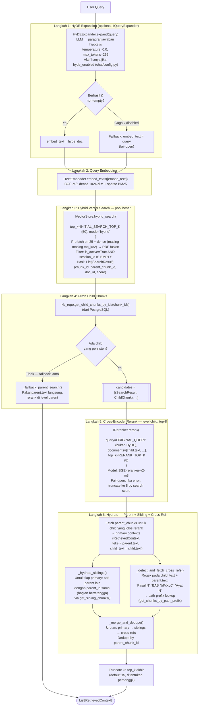
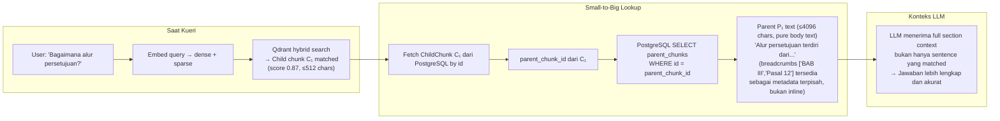

# 07. Pipeline Retrieval

> Sumber: `writing/chapter3.md` §3.5 (diadaptasi menjadi dokumen referensi mandiri).

## 7.1 Gambaran Umum

Pipeline retrieval adalah jalur baca (*read-path*). `SearchService` mengorkestrasikan **enam langkah** dari kueri mentah hingga daftar `RetrievedContext` yang siap dikonsumsi `ChatService` (lihat [08-pipeline-chat.md](08-pipeline-chat.md)): (1) HyDE opsional, (2) embed, (3) hybrid search menghasilkan pool kandidat besar (`top_k=50`), (4) fetch *child chunk* langsung dari PostgreSQL berdasarkan id, (5) *rerank* cross-encoder pada level child menjadi top-8, (6) *hydrate* — ambil parent dari child yang lolos rerank, lalu perluas dengan *sibling* dan *cross-reference* chunk sebelum digabung dan di-dedupe.

Dipanggil lewat `GET /api/kb/search` (lihat [10-referensi-api.md](10-referensi-api.md)) untuk debugging/evaluasi, dan secara internal (bukan lewat HTTP) oleh `ChatService`.

## 7.2 Diagram 6-Langkah Retrieval

Catatan desain: Langkah 5 me-rerank **teks child** (presisi, ≤512 char) terhadap kueri asli, bukan teks parent yang sudah dirakit — menghasilkan sinyal rerank yang lebih tajam. Parent (konteks lengkap untuk LLM) baru diambil setelah keputusan rerank final di Langkah 6, mempertahankan prinsip Small-to-Big: presisi match di level child, kelengkapan konteks di level parent.

## 7.3 Desain Small-to-Big Retrieval

## 7.4 Hybrid Search dengan RRF Fusion

Langkah 3 (hybrid search) menjalankan dua prefetch paralel yang digabungkan dengan **Reciprocal Rank Fusion (RRF)**:

$$\text{score}_{\text{RRF}}(d) = \sum_{r \in \{dense,\, sparse\}} \frac{1}{k + \text{rank}_r(d)}$$

Di mana $k = 60$ (konstanta default Qdrant). RRF berbasis peringkat — bukan skor absolut — sehingga robust terhadap distribusi skor yang berbeda antara cosine similarity dan BM25. Setiap prefetch mengambil `top_k × 2` kandidat untuk memperluas pool sebelum fusion. RRF di sini hanya menentukan pool kandidat awal (Langkah 3, `top_k=50`) — keputusan akhir konteks mana yang benar-benar dipakai LLM ditentukan oleh cross-encoder rerank di Langkah 5, bukan skor RRF.

## 7.5 Hidrasi Sibling dan Cross-Reference

Dokumen institusional (peraturan, SOP) sering merujuk pasal/bagian lain secara eksplisit ("sebagaimana diatur dalam Pasal 5") atau menyimpan informasi terkait di bagian bertetangga secara struktural tanpa disebut ulang secara semantik pada teks yang match kueri. Vector search murni tidak menangkap kebutuhan ini karena kaitannya struktural, bukan semantik. Langkah 6 menambahkan dua sumber konteks tambahan di atas hasil rerank:

- **Sibling hydration** — memanfaatkan hierarki `parent_id`/`path`/`depth` yang sudah dibangun saat chunking (§6.5): untuk setiap konteks utama, ambil parent chunk lain yang berbagi `parent_id` yang sama (bagian-bagian di bawah judul yang sama).
- **Cross-reference detection** — memindai teks konteks utama dengan pola regex untuk gaya rujukan dokumen legal Indonesia (`Pasal N`, `BAB N`/angka Romawi, `Ayat N`), lalu mencari chunk dengan `path` yang berawalan sesuai.

Kedua sumber ini diberi `score=0.0` (tidak punya skor pencarian langsung) dan ditempatkan setelah primary contexts saat *merge+dedupe*, sehingga urutan relevansi hasil rerank tetap diutamakan. Catatan: pola regex cross-reference (`Pasal`/`BAB`/`Ayat`) berbentuk konvensi dokumen legal Indonesia secara spesifik — bagian implementasi yang tidak sepenuhnya domain-agnostic seperti prinsip di [00-gambaran-umum.md](00-gambaran-umum.md), meski tidak memengaruhi jalur retrieval utama jika tidak ada pola yang cocok (regex tidak match hanya berarti tidak ada cross-ref tambahan, bukan kegagalan).

---
⟵ [06-pipeline-ingestion.md](06-pipeline-ingestion.md) | [README.md](README.md) (indeks) | [08-pipeline-chat.md](08-pipeline-chat.md) ⟶
