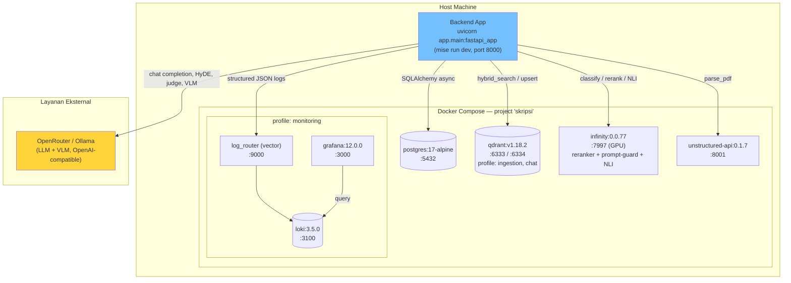

# 11. Deployment & Infrastruktur

> Sumber: `docker-compose.yaml`, `.env.example`, `mise.toml`, `app/main.py` (diverifikasi langsung terhadap kode).

## 11.1 Menjalankan Aplikasi

Aplikasi backend (FastAPI) **tidak** di-containerize di `docker-compose.yaml` — hanya dependensi infrastrukturnya (database, vector store, model inference, parser, observability) yang dijalankan sebagai container. Backend dijalankan langsung di host via `mise` (Python 3.11, virtualenv `.venv`):

```bash
mise run dev
# = uvicorn app.main:fastapi_app --reload
```

`app/main.py` (`lifespan`) menginisialisasi skema Postgres (termasuk ekstensi `ltree` dan ALTER TABLE guarded untuk kolom baru) serta memastikan collection Qdrant tersedia setiap kali aplikasi start — tidak ada langkah migrasi terpisah yang wajib dijalankan manual.

## 11.2 Tabel Layanan Docker Compose

Compose project bernama `skripsi`. Semua port di-bind ke `127.0.0.1` saja (tidak diekspos ke jaringan luar secara default).

| Service | Image | Port (host) | Profile | Peran |
|---|---|---|---|---|
| `postgres` | `postgres:17-alpine` | `5432` | *(selalu aktif)* | Basis data relasional — dokumen, chunks, sesi, pesan |
| `qdrant` | `qdrant/qdrant:v1.18.2` | `6333` (HTTP), `6334` (gRPC) | `ingestion`, `chat` | Vector store hybrid (dense + sparse/BM25) |
| `infinity` | `michaelf34/infinity:0.0.77` | `7997` | *(selalu aktif)* | Server inferensi ML: reranker (BGE-reranker-v2-m3), prompt-guard (Llama-Prompt-Guard-2-86M), NLI (indo-roberta-indonli). Butuh GPU NVIDIA (`deploy.resources.reservations.devices`) |
| `unstructured-api` | `quay.io/unstructured-io/unstructured-api:0.1.7` | `8001` (host) → `8000` (container) | *(selalu aktif)* | Parsing PDF → elemen terstruktur |
| `loki` | `grafana/loki:3.5.0` | `3100` | `monitoring` | Penyimpanan log |
| `log_router` | `timberio/vector:0.47.0-alpine` | `9000` | `monitoring` | Meneruskan log Docker → Loki |
| `grafana` | `grafana/grafana:12.0.0` | `3000` | `monitoring` | Dashboard observability |

Service **LLM** (OpenRouter cloud, atau Ollama lokal opsional — dikomentari di `docker-compose.yaml`) dan **VLM** (deskripsi gambar/figur) **tidak** dijalankan sebagai container terkelola compose ini — dipanggil sebagai API eksternal (OpenRouter) atau proses lokal terpisah (Ollama, jika dipakai), dikonfigurasi murni lewat env var.

Volume persisten: `postgres_data`, `qdrant_data`, `infinity_cache`, `loki_data`, `grafana_data`, `ollama_data` (tidak terpakai selama service `ollama` masih dikomentari).

## 11.3 Diagram Topologi Deployment



## 11.4 Ringkasan Variabel Lingkungan Penting

Konfigurasi memakai `pydantic-settings` dengan prefix per modul (lihat `app/shared/config.py`, `app/chat/config.py`, `app/kb/config.py`). Sebagian besar bernilai default aman untuk pengembangan lokal; yang wajib diisi (`[REQUIRED]` di `.env.example`):

| Prefix | Wajib diisi | Contoh |
|---|---|---|
| `POSTGRES_` | `POSTGRES_PASSWORD` | Kredensial database |
| `LOGGER_` | `LOGGER_PASSWORD` | Password admin Grafana |
| — | `HF_TOKEN` | Token Hugging Face (dipakai Infinity & Unstructured untuk unduh model) |
| `CHAT_` | `CHAT_LLM_API_KEY` | API key OpenRouter (atau `dummy` jika memakai Ollama lokal) |

Variabel opsional penting yang memengaruhi perilaku sistem (bukan sekadar koneksi): `CHAT_OOD_METHOD` (pilih backend IVM relevansi — lihat [09-ivm-ram-keamanan.md](09-ivm-ram-keamanan.md)), `CHAT_HYDE_ENABLED`, `VLM_MODE`, `BGE_M3_DEVICE`. Detail lengkap tiap variabel didokumentasikan sebagai komentar inline di [`.env.example`](../.env.example).

---
⟵ [10-referensi-api.md](10-referensi-api.md) | [README.md](README.md) | [00-gambaran-umum.md](00-gambaran-umum.md) ⟶
