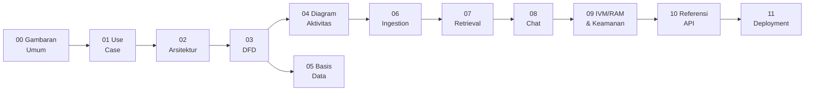

# Dokumentasi Teknis — Chatbot RAG Domain-Agnostic

Dokumentasi teknis mandiri untuk aplikasi ini: chatbot berbasis Retrieval-Augmented Generation (RAG) dengan dua modul guardrail kustom — **IVM** (validasi input: keamanan prompt + relevansi domain) dan **RAM** (penilaian respons: deteksi halusinasi per-kalimat via NLI). Seluruh diagram memakai sintaks Mermaid (langsung ter-render di GitHub/kebanyakan viewer Markdown).

> Dokumentasi ini independen dari naskah skripsi (`writing/`), meski mengadaptasi fakta teknis yang sama — lihat `writing/chapter3.md` untuk versi naratif akademis (Bahasa Indonesia, format Bab).

## Daftar Isi

| # | Dokumen | Isi |
|---|---|---|
| 00 | [Gambaran Umum](00-gambaran-umum.md) | Tujuan sistem, 3 masalah RAG yang diselesaikan, 3 kontribusi utama, tech stack, glosarium istilah |
| 01 | [Diagram Use Case](01-use-case.md) | Aktor (Pengguna, Admin) dan use case yang didukung, diturunkan dari API aktual |
| 02 | [Arsitektur](02-arsitektur.md) | Domain-Driven Design, aturan dependensi, Protocol interfaces, layanan eksternal, composition root |
| 03 | [Data Flow Diagram (DFD)](03-dfd.md) | Context Diagram (Level 0) & Level 1 DFD — entitas eksternal, proses bernomor, data store |
| 04 | [Diagram Aktivitas](04-diagram-aktivitas.md) | Alur proses chat & ingestion dengan swimlane per aktor/komponen |
| 05 | [Basis Data](05-basis-data.md) | ERD PostgreSQL, deskripsi tabel, skema koleksi Qdrant |
| 06 | [Pipeline Ingestion](06-pipeline-ingestion.md) | Alur unggah PDF → parsing → chunking hierarkis → embedding → indeks vektor |
| 07 | [Pipeline Retrieval](07-pipeline-retrieval.md) | 6 langkah pencarian: HyDE, hybrid search, RRF fusion, rerank, hidrasi Small-to-Big |
| 08 | [Pipeline Chat](08-pipeline-chat.md) | Alur end-to-end permintaan chat, event stream NDJSON |
| 09 | [IVM, RAM & Keamanan](09-ivm-ram-keamanan.md) | Deteksi prompt injection, gate relevansi domain, penilaian halusinasi, defense-in-depth |
| 10 | [Referensi API](10-referensi-api.md) | Seluruh endpoint REST (chat, admin KB, halaman frontend) |
| 11 | [Deployment](11-deployment.md) | Topologi Docker Compose, port, variabel lingkungan |

## Alur Baca yang Disarankan

Untuk orientasi pertama kali: **00 → 01 → 02 → 03** (gambaran besar), lalu **06 → 07 → 08 → 09** (detail tiap pipeline), lalu **05, 10, 11** sebagai referensi teknis sesuai kebutuhan. Dokumen **04** paling berguna setelah membaca 06/08, sebagai pelengkap pandangan lintas-aktor.

