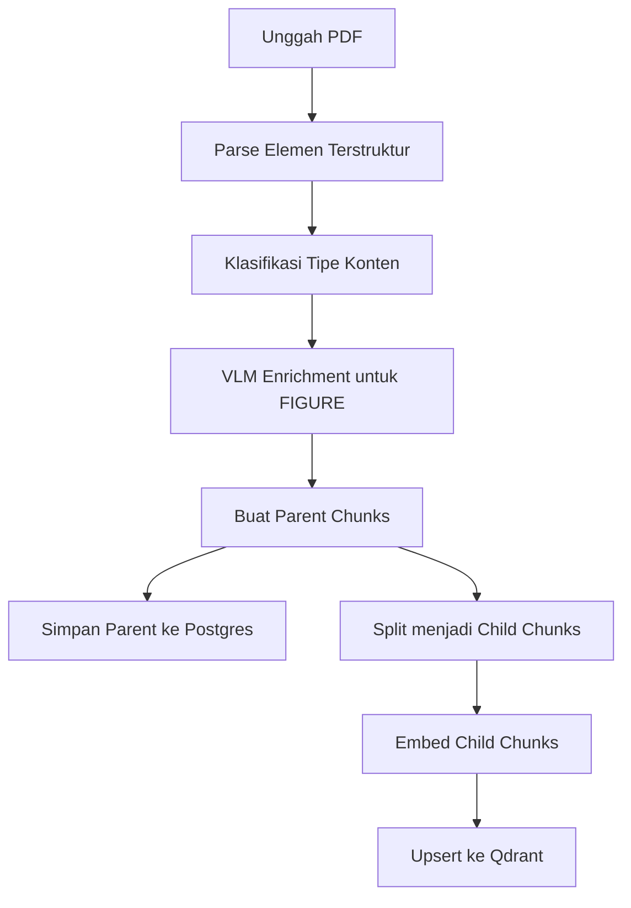
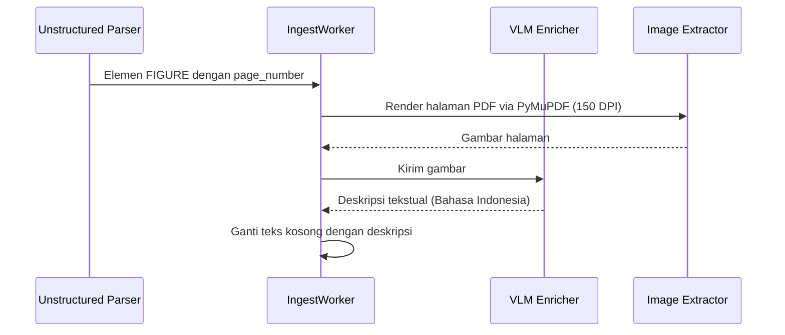
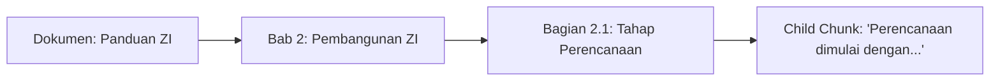

# Bagaimana sebuah PDF Diproses menjadi Knowledge Base?

Ingesti PDF menjadi _Knowledge Base_ (KB) adalah pipeline multi-tahap yang dirancang untuk mengekstrak makna, mempertahankan struktur dokumen (termasuk tabel dan gambar), dan menyiapkan data untuk retrieval hibrida yang akurat. Berbeda dengan RAG standar yang hanya memproses teks, pipeline ini bersifat **multimodal-aware** — setiap tipe konten (teks, tabel, gambar) diperlakukan dengan strategi pemecahan yang berbeda.

## Pipeline Ingesti

Seluruh proses diorkestrasi oleh `IngestWorker`.

**Berkas:** `app/kb/application/ingest_worker.py`
**Fungsi:** `IngestWorker.ingest_document(self, doc_id: str)`

### 1. Parsing PDF menjadi Elemen Terstruktur

Langkah pertama mengubah PDF mentah menjadi elemen terstruktur (narasi, judul, tabel, gambar) menggunakan Unstructured API.

**Berkas:** `app/kb/infra/unstructured_client.py`
**Fungsi:** `UnstructuredClient.parse_pdf()`

Parser ini menghasilkan elemen bertipe `NarrativeText`, `Title`, `ListItem`, `Table`, `Image`, dan lainnya — lengkap dengan metadata seperti `page_number` dan hierarki judul. Tipe elemen ini menjadi dasar klasifikasi konten pada tahap berikutnya.

### 2. Klasifikasi Tipe Konten

Setiap elemen yang diparse diklasifikasikan ke dalam salah satu dari empat tipe konten oleh fungsi `classify_element()`. Klasifikasi ini bersifat **deterministik dan berbasis aturan** (rule-based), bukan model ML.

**Berkas:** `app/thesis/chunking/router.py`
**Fungsi:** `classify_element()`

| Tipe Konten | Elemen Pemicu                                            | Strategi Pemecahan                                     |
| ----------- | -------------------------------------------------------- | ------------------------------------------------------ |
| `TEXT`      | NarrativeText, Title, ListItem, Header, Footer (default) | RecursiveCharacterTextSplitter (berbasis kalimat)      |
| `TABLE`     | Table                                                    | Tidak dipecah — disimpan utuh sebagai satu child chunk |
| `FIGURE`    | Image, Figure                                            | Deskripsi VLM → pecah berbasis kalimat jika panjang    |
| `HYBRID`    | Kombinasi (fallback)                                     | Pecah berbasis kalimat                                 |

**Rasional desain — mengapa berbasis aturan, bukan ML?** Tipe elemen dari Unstructured API sudah terstruktur (mis. `element_type == "Table"`), sehingga pemetaan langsung lebih andal dan tidak memerlukan data latih. Klasifikasi ML akan menambah kompleksitas tanpa manfaat yang signifikan karena sumber kebenaran sudah tersedia dari parser.

### 3. VLM Enrichment untuk Gambar

Elemen `FIGURE` dengan teks kosong (gambar tanpa keterangan) diperkaya dengan deskripsi tekstual sebelum di-chunking. Implementasi di `IngestWorker._enrich_figures()` terdiri dari tiga langkah:

**Berkas:** `app/kb/application/ingest_worker.py`
**Fungsi:** `IngestWorker._enrich_figures()`

1. **Ekstraksi Gambar Halaman**: Untuk setiap elemen FIGURE, halaman PDF yang relevan dirender via PyMuPDF pada 150 DPI, menggunakan metadata `page_number` dari elemen Unstructured.
2. **Invokasi VLM**: Gambar halaman dikirim ke Vision Language Model melalui `IVLMEnricher.describe_image()`. VLM menghasilkan deskripsi tekstual dalam Bahasa Indonesia (mis. "Flowchart menunjukkan lima tahap pembangunan ZI: perencanaan, implementasi, evaluasi, penilaian, penegakan").
3. **Fail-Closed Filtering**: Elemen FIGURE yang gagal diperkaya (error VLM atau VLM tidak tersedia) dan masih memiliki teks kosong **difilter keluar** dari pipeline — tidak dapat di-embed dan akan menghasilkan vektor yang tidak bermakna.

**Tiga mode VLM yang dapat dikonfigurasi** (env var `VLM_MODE`):

| Mode       | Adapter               | Deskripsi                                                                                                                               |
| ---------- | --------------------- | --------------------------------------------------------------------------------------------------------------------------------------- |
| `cloud`    | `OpenRouterVLMClient` | VLM cloud (Gemini, GPT-4o) via OpenRouter API. Kapabilitas deskripsi tertinggi. Memerlukan API key.                                     |
| `local`    | `OllamaVLMClient`     | VLM lokal (LLaVA, Qwen-VL) via Ollama. Privasi data penuh. Kapabilitas lebih terbatas.                                                  |
| `fallback` | `FallbackVLMClient`   | Tanpa VLM. Analisis drawing PyMuPDF untuk deskripsi heuristik (mis. deteksi flowchart berbasis jumlah objek gambar ≥ 10). Mode default. |

**Rasional desain — mengapa `fallback` sebagai default?** Memastikan sistem berfungsi tanpa konfigurasi VLM tambahan, dengan jalur peningkatan (upgrade path) ke `cloud`/`local` ketika sumber daya tersedia. Ini konsisten dengan filosofi fail-closed sistem: gambar yang tidak dapat dideskripsikan dengan andal tidak masuk ke KB daripada memasukkan vektor yang menyesatkan.

### 4. Hierarchical Parent-Child Chunking

Sistem menggunakan strategi **parent-child chunking** dengan strategi pemecahan yang berbeda per tipe konten.

**Berkas:** `app/thesis/chunking/logic.py`
**Fungsi:** `create_parent_chunks()`, `split_into_children()`

#### a. Elemen TEXT (Narasi Prosa)

- **Parent chunks**: Dikelompokkan berdasarkan deteksi batas bagian (elemen `Title`). Parent chunk dibatasi hingga ~2000 karakter.
- **Child chunks**: Menggunakan LangChain `RecursiveCharacterTextSplitter` dengan ukuran chunk 512 karakter, overlap 50 karakter, separator berbasis kalimat.
- Setiap child chunk diberi prefix **breadcrumb** (hierarki judul dari parent chunk).

#### b. Elemen TABLE (Tabel Terstruktur)

- Tidak dikelompokkan dengan TEXT — setiap tabel menjadi parent chunk tersendiri. Mencegah pencampuran konteks prosa dengan struktur tabel.
- Tabel **tidak dipecah** menjadi child chunk lebih kecil; seluruh HTML tabel disimpan sebagai satu child chunk.
- Jika tersedia, ringkasan tabel (dari `element_metadata["table_summary"]`) ditambahkan sebagai child chunk kedua.

**Rasional desain — mengapa tabel disimpan utuh?** Memecah tabel akan merusak integritas struktur sel yang penting untuk data tabular regulasi (mis. matriks LKE Pembangunan ZI). Tabel utuh sebagai satu chunk memastikan LLM dapat membaca baris dan kolom secara koheren.

#### c. Elemen FIGURE (Gambar/Diagram)

- FIGURE yang sudah diperkaya VLM diproses sebagai parent chunk tersendiri.
- Jika deskripsi VLM pendek (≤ 512 karakter), disimpan sebagai satu child chunk.
- Jika panjang, dipecah via `RecursiveCharacterTextSplitter` berbasis kalimat.

### 5. Breadcrumb Context

Saat PDF di-parse, sistem tidak membelah secara buta. Sistem mengidentifikasi batas struktural seperti elemen `Title`. Saat child chunk dibuat, ia membawa daftar `breadcrumbs` yang melacak jalur hierarkis dokumen.

**Rasional desain — mengapa breadcrumb?** Saat child chunk diretrieve, LLM tahu persis dari mana chunk itu berasal dalam struktur dokumen, menghindari kehilangan konteks semantik. Tanpa breadcrumb, child chunk yang berisi "Tahap pertama adalah..." tidak akan diketahui merujuk ke "Tahap Perencanaan" dalam "Pembangunan ZI".

### 6. Penyimpanan dan Pengindeksan Vektor

Setiap child chunk disimpan di Qdrant dengan payload yang menyertakan field `content_type` (nilai: `text`, `table`, `figure`, `hybrid`).

**Berkas:** `app/kb/infra/qdrant_store.py`
**Fungsi:** `QdrantStore.upsert_chunks()`

Field `content_type` diindeks sebagai tipe `KEYWORD` untuk mendukung filtering pencarian berbasis tipe konten di masa depan (mis. mencari hanya dalam tabel untuk kueri spesifik data tabular).

Representasi vektor menggunakan model **BGE-M3** yang menghasilkan vektor **dense (1024-dim)** dan **sparse (BM25)** secara simultan, difusikan via **Reciprocal Rank Fusion (RRF, k=60)**.

**Penyimpanan terpisah:**

- **Postgres**: Menyimpan parent chunk besar untuk retrieval full-text nanti.
  - **Berkas:** `app/kb/infra/postgres_repo.py`
  - **Fungsi:** `PostgresKBRepository.save_parent_chunks()`
- **Embedding**: Child chunk dikonversi menjadi vektor dense dan sparse.
  - **Berkas:** `app/kb/infra/infinity_embeddings.py`
  - **Fungsi:** `InfinityEmbeddings.embed_texts()`
- **Qdrant**: Vektor child di-upsert ke vector database untuk hybrid search.
  - **Berkas:** `app/kb/infra/qdrant_store.py`
  - **Fungsi:** `QdrantStore.upsert_chunks()`

**Rasional desain — mengapa pemisahan parent di Postgres dan child di Qdrant?** Strategi _small-to-big_: child chunk kecil dioptimalkan untuk akurasi pencarian vektor (presisi), sementara parent chunk besar di Postgres menyediakan konteks lengkap untuk LLM (recall). Saat child cocok ditemukan, parent-nya di-fetch untuk memberikan konteks utuh kepada LLM.
